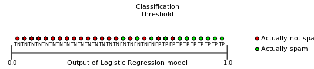

# Precision, recall and Accuracy

## Single label case

### Precision, recall and accuracy

$$
\text{Precision} = \frac{tp}{tp+fp}
$$

$$
\text{Recall} = \frac{tp}{tp+fn}
$$

$$
\text{Accuracy} = \frac{tp+tn}{tp+tn+fp+fn}
$$

### Relationship between precision and recall

To fully evaluate the effectiveness of a model, you must examine **both** precision and recall. Unfortunately, precision and recall are often in tension. That is, improving precision typically reduces recall and vice versa.

### Sensitivity and specificity

$$
\text{Sensitivity} = \text{Recall}
$$

$$
\text{Specificity} = \frac{tn}{tn+fp}
$$

## Multi label case

$$
\text{Overall Accuracy} = \frac{\text{# of correctly classified samples}}{\text{# of samples}}
$$

## References

1. [Machine Learning Crash Course: Classification: Precision and Recall](https://developers.google.com/machine-learning/crash-course/classification/precision-and-recall)
2. Machine Learning Crash 

