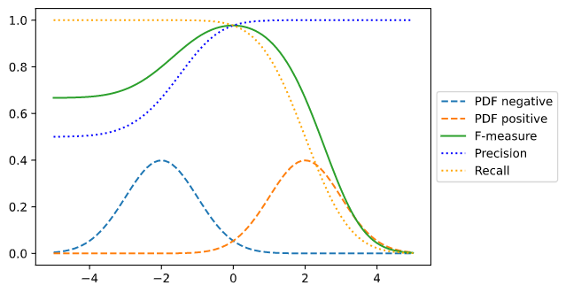

# Precision, recall and Accuracy

## Two label case

### Precision, recall, specificity and accuracy

Precision, positive prediction value \(PPV\)

$$
\text{PPV} = \frac{tp}{tp+fp}
$$

Recall, sensitivity, hit rate, true positive rate \(TPR\)

$$
\text{TPR} = \frac{tp}{tp+fn}
$$

Specificity, selectivity, true negative rate \(TNR\)

$$
\text{TNR} = \frac{tn}{tn+fp}
$$

Accuracy

$$
\text{Accuracy} = \frac{tp+tn}{tp+tn+fp+fn}
$$

### Relationship between precision and recall

To fully evaluate the effectiveness of a model, you must examine **both** precision and recall. Unfortunately, precision and recall are often in tension. That is, improving precision typically reduces recall and vice versa.

### F-measure

$$
F_1 = \frac{2}{\text{recall}^{-1} + \text{precision}^{-1}} = 2\cdot\frac{\text{precision}\cdot\text{recall}}{\text{precision}+\text{recall}}
$$

For two Gaussian distributions.

### ROC curve

Plot **true positive rate** and **false positive rate** under various classification thresholds. AUC is the area under the ROC curve. The best is AUC-score is 1 while the worst is 0.5.

For ensemble method that uses two or more classifiers, ROC curve will be a piecewise function.

## Multi label case

$$
\text{Overall Accuracy} = \frac{\text{# of correctly classified samples}}{\text{# of samples}}
$$

## References

1. [Machine Learning Crash Course: Classification: Precision and Recall](https://developers.google.com/machine-learning/crash-course/classification/precision-and-recall)

