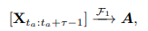

# Surveys

## LLM

### Popular LLMs

### Issue

Hallucination

Generating statements that are factually incorrect. Especially in high-stakes scenarios such as medical diagnosis and legal judgment.

## LLM and Knowledge Graph

### KG-enhanced LLMs

.png>)

### LLM-augmented for KG Tasks

.png>)

#### KG embedding

Task definition: map entity and relation into a embedding space.

Either use LLM embeddings or learning embeddings using pre-training tasks

#### KG construction

Approaches

Procedural: 1) entity discovery 2) coreference resolution 3) relation extraction

End-to-end system

Distilling knowledge graphs from LLMs

Procedural approach

Entity discovery

LLM for NER, entity typing and entity linking. Coreference resolution

Relation extraction

End to end system

Grapher, PiVE (prompting)

### Synergized LLMs + KGs

.png>)

## References

1. Unifying Large Language Models and Knowledge Graphs: A Roadmap
