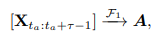

# Attention Mechanism in NN

## Idea

For each input that LSTM \(Encoder\) reads, the attention-mechanism takes into account several other inputs at the same time and decides which ones are important by attributing different weights to those inputs.

## Transformer

### Overview

The encoder is on the left and the decoder is on the right.

### Scaled Dot-Product Attention

$$
Attention(Q,K,V) = softmax(\frac{QK^\intercal}{\sqrt{d_k}})V
$$

Q: a matrix that contains the query, and it is vector representation of one word in the sequence

K: all the keys, and they are vector representations of all the words in the sequence

V: all the values, and they are vector representations of all the words in the sequence

For the encoder and decoder, multi-head attention modules, V consists of the same word sequence as Q.

For the attention module that is taking the encoder and the decoder sequences, V is different from the sequence represented by Q.

## References

1. [Medium: Transformer](https://medium.com/inside-machine-learning/what-is-a-transformer-d07dd1fbec04)

