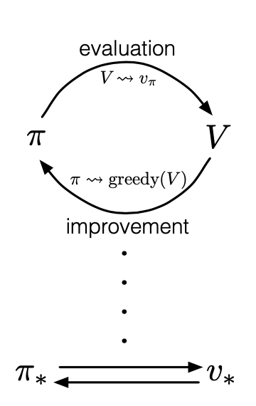

# Generalised Policy Iteration \(GPI\)

It is similar to the expectation-maximisation algorithm. Policy iteration consists of two interaction processes, policy-evaluation and policy-improvement.

Policy-evaluation process evaluates the value function based on the current policy.

Policy-improvement process improves the policy by making the policy greedy with respect to the current value function.

$$ \pi(s) := \arg\underset{a}{\max} \ q(s,a)$$ 

The iteration ends when both value function and policy are optimal.

The greedy algorithm is proved to generate a policy that achieves not worse **expected return** than the previous policy achieves with respect to the current value function.

Note: 

Greedy policy does not mean that we should always choose the best policy. Instead, we just need to make sure the new policy chosen should not achieve worse expected return.

## Issues

### Imperfect evaluation of the value function

Policy evaluation may not be perfect \(which means the value function does not converge to the value function for that policy\) when MC or TD is used and some state-action pairs are not explored, GPI may not give the optimal value function and policy.

#### Solution

Two approaches \(under the context that some sampling method is used\)

_On-policy method_

On-policy methods evaluate or improve the policy that is used to generate sample sequence-action-reward sequences.

Example: MC exploring starts method \(ensures that all possible state-action pairs have positive probability of being the starting pair\).

_Off-policy method_

Off-policy methods evaluate or improve a policy different from that used to generate the data.

Example: Importance sampling.

## References

1. R. S. Sutton and A. G. Barto, Reinforcement learning: An introduction. MIT press, 2018. [Link](https://mitpress.mit.edu/books/reinforcement-learning-second-edition)

