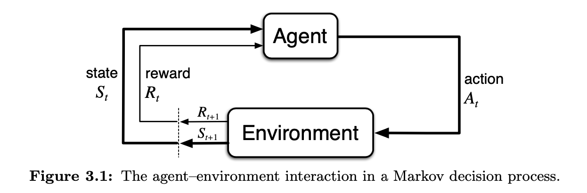

# Finite Markov Decision Processes \(MDPs\)

## Notations

| Notation | Definition |
| :--- | :--- |
| $$t$$ | Timestamp |
| $$S_t$$ | Random variable state at timestamp $$t$$ |
| $$\mathcal{S}$$ | Set of all states |
| $$A_t$$ | Random variable action at timestamp $$t$$ |
| $$\mathcal{A}(s)$$ | Set of all actions at state s |
| $$R_t$$ | Random variable reward at timestamp $$t$$ |
| $$\mathcal{R}$$ | Set of all rewards |

## Model

## References

1. R. S. Sutton and A. G. Barto, Reinforcement learning: An introduction. MIT press, 2018. [Link](https://mitpress.mit.edu/books/reinforcement-learning-second-edition)

